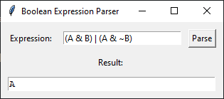

# Boolean Expression Parser with SymPy and Tkinter GUI
This Python program simplifies boolean expressions using the SymPy library and provides a user-friendly graphical interface using Tkinter.

## Features
- Boolean Expression Simplification: Utilizes SymPy to simplify boolean expressions, reducing them to their simplest form.
- Interactive GUI: Provides a graphical interface using Tkinter, allowing users to input boolean expressions and instantly see the simplified results.

## How to Use
**Prerequisites**

Make sure you have Python installed on your system. You can download it from python.org.

**Installation**
1. Clone this repository to your local machine:
```bash
git clone https://github.com/your-username/boolean-expression-simplifier.git
```

2. Open the repository folder and install the required dependencies:
```bash
pip install -r requirements.txt
```

**Usage**

Run the Parser.py script located in the BoolExpParser directory:
```bash
python BoolExpParser/Parser.py
```

This will launch the Tkinter GUI. Enter your boolean expression in the input field and click the "Simplify" button to see the simplified result.

## Sample Output
For example, if you input the expression (A & B) | (A & ~B), the program will simplify it to just A.

**Screenshot**


